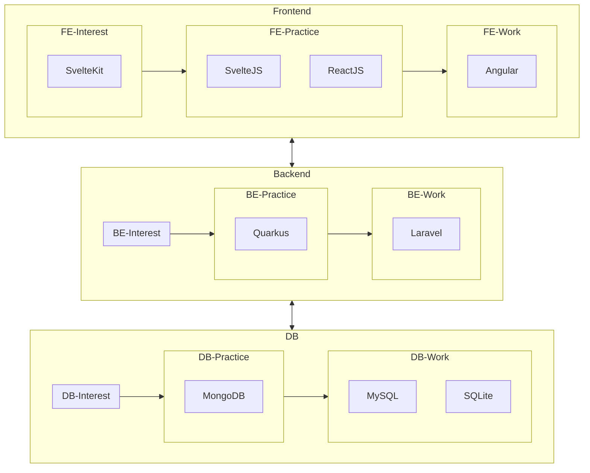
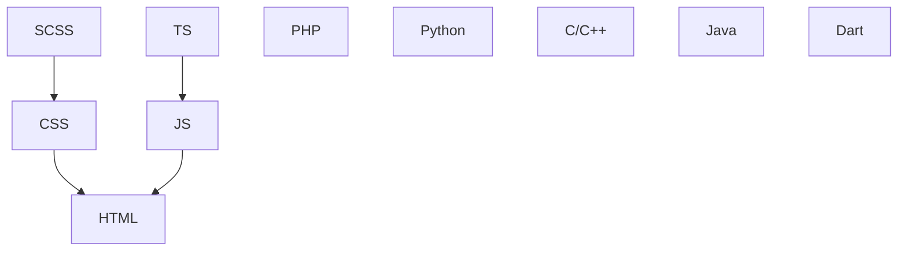
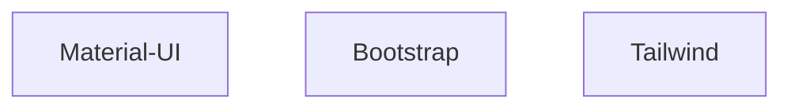
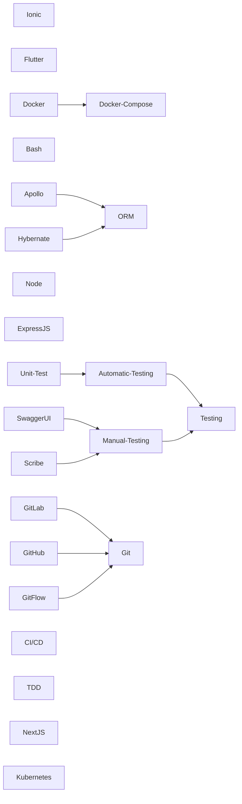

# Components in progress

## Web Technology Stack

```mermaid
flowchart
    subgraph Frontend
        subgraph FE-Work
            Angular
        end
        subgraph FE-Practice
            SvelteJS
            ReactJS
        end
        subgraph FE-Interest
            SvelteKit
        end
        FE-Interest-->FE-Practice-->FE-Work
    end
    subgraph Backend
        subgraph BE-Work
            Laravel
        end
        subgraph BE-Practice
            Quarkus
        end
        subgraph BE-Interest
        end
        BE-Interest-->BE-Practice-->BE-Work
    end
    subgraph DB
        subgraph DB-Work
            MySQL
            SQLite
        end
        subgraph DB-Practice
            MongoDB
        end
        subgraph DB-Interest
        end
        DB-Interest-->DB-Practice-->DB-Work
    end

    Frontend<-->Backend<-->DB
```

## Languages

```mermaid
flowchart
    SCSS-->CSS
    CSS-->HTML
    TS-->JS
    JS-->HTML
    PHP
    Python
    C/C++
    Java
    Dart
```

## UI-Frameworks

```mermaid
flowchart
   Material-UI
   Bootstrap
   Tailwind
```

## Things that have not yet been assigned

```mermaid
flowchart LR
    Ionic
    Flutter
    Docker --> Docker-Compose
    Bash
    Apollo --> ORM
    Hybernate --> ORM
    Node
    ExpressJS
    SwaggerUI --> Manual-Testing
    Scribe --> Manual-Testing
    Unit-Test --> Automatic-Testing
    Automatic-Testing --> Testing
    Manual-Testing --> Testing
    GitLab --> Git
    GitHub --> Git
    GitFlow --> Git
    CI/CD
    TDD
    NextJS
    Kubernetes
```
